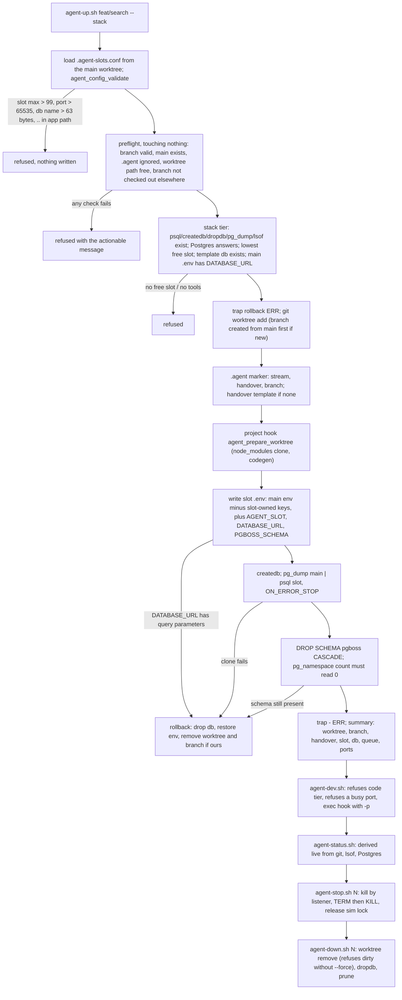

# How agent-slots works

For whoever owns this next, including me in six months. It assumes the README and aims to let you defend every number without opening the code. `docs/design.md` is the contract, `docs/acceptance.md` the evidence, `docs/lessons.md` the scars; this is the tour. Verified against v0.1.0, 23 Aug 2026.

## The story, in one paragraph

Two coding agents worked one repository in two Git worktrees and each ran a dev server. Both servers pointed at the same PostgreSQL database and, inside it, the same pg-boss job queue. The queue handed a scheduled job to whichever server claimed it first; that server ran older code with a handler that had no due-check, and it ran the job for every user on the wrong day. The first diagnosis, "a cron schedule got rewritten," was wrong. The real cause was that a worktree isolates files and nothing else. agent-slots is the smallest fix: one integer, `AGENT_SLOT`, derives a sibling worktree, a cloned database, two ports, and a queue schema, and only slot 0, the original checkout, may register recurring schedules. State is read live from Git, lsof, and Postgres, never from a registry file. Sixty tests run in CI; the acceptance run left the main database's 10 schedule rows untouched while two slots ran.

| Resource | Derivation | Example (slot 1) |
|---|---|---|
| `agent_slot` | N; slot 0 = main | 1 |
| Worktree | `../<prefix><branch-slug>`, sibling, never nested | `../demo-feat-search` |
| Database | `<prefix>N`; slot 0: `<slug>_dev` | `demo_a1` |
| Web port | `3000 + 100·N` | 3100 |
| Bundler port | `8081 + 100·N` | 8181 |
| Queue schema | `pgboss_aN`; slot 0: `pgboss` | `pgboss_a1` |
| Schedule owner | `N == 0` | no |

Every formula lives once, in `scripts/lib/agent-slot.sh`, and every other script sources it. That is why eight scripts cannot disagree about what slot 3's database is called.

## One run

What actually happens when you type `scripts/agent-up.sh feat/search --stack` in a project that has a `.agent-slots.conf`. This is the sequence the demo GIF records.



1. **Load and validate configuration.** The library reads `.agent-slots.conf` from the main worktree, never the current one, then `agent_config_validate` refuses anything that could collide or escape: slot max above 99, a port formula that exceeds 65535 at the top slot, two slots mapping to one port, a database name over 63 bytes, a schema name over 50, an app path with `..` in it.
2. **Preflight, touching nothing.** The branch name is valid; main exists; `.agent` is gitignored; the worktree path is free (or this is an in-place `--stack` upgrade of a code-tier worktree on the same branch); the branch is not checked out elsewhere; the optional conflict env file does not carry a second `DATABASE_URL`. For the stack tier: `psql`, `createdb`, `dropdb`, `pg_dump`, `lsof` exist; Postgres answers; the lowest slot with no database and no listening port is chosen; the template database exists; the main `.env` has a non-empty `DATABASE_URL`.
3. **Arm the rollback, then create.** `trap rollback ERR` is set before `git worktree add`. If the branch does not exist it is created from main as its own atomic step, and only after that succeeds is it marked as ours, so a rollback can never delete a branch another agent created in the same second.
4. **Write intent.** A gitignored `.agent` marker records the stream slug, handover path and branch. If no handover exists at `docs/plans/<stream>-handover.md`, a template is created, untracked, ready to commit.
5. **Run the project hook.** `agent_prepare_worktree main worktree`, whatever the project defined: cloning `node_modules` with `cp -Rc` (APFS clone), running codegen. The default is a no-op.
6. **Write the slot env.** Every line of the main `.env` is copied except the keys the slot owns (`AGENT_SLOT`, `DATABASE_URL`, `PGBOSS_SCHEMA`, the public-URL key), then those are appended. The database URL is the main one with only the trailing database name rewritten; credentials are never synthesised. A URL with query parameters is refused.
7. **Clone the database.** `createdb`, then `pg_dump main | psql slot` with `ON_ERROR_STOP`. Not `CREATE DATABASE ... TEMPLATE`, because a template clone fails while any session holds the source, and a dev database always has one.
8. **Drop the inherited queue schema.** `DROP SCHEMA pgboss CASCADE` on the clone, then a count of `pg_namespace` must read 0 or the whole provision rolls back. This is the step that guarantees a non-owner slot can never fire a cron it inherited.
9. **Disarm and report.** `trap - ERR`, then the summary block: worktree, branch, handover, slot, database, queue, both ports.

From inside the worktree, `scripts/agent-dev.sh` refuses a code-tier tree (no `AGENT_SLOT` in its env) with the exact upgrade command, refuses if the slot's port is already listening, and otherwise calls the project's `agent_start_web` hook with the port as an explicit argument. `agent-stop.sh 1` kills whatever listens on 3100 and 8181 by PID, TERM then KILL, and releases the simulator lock if slot 1 holds it. `agent-down.sh 1` does that, then removes the worktree (refusing a dirty one without `--force`), drops the database, and prunes.

## The code, in run order

Eight scripts under `scripts/`, one library, one probe, one TypeScript integration. The order below is the order a stack slot touches them.

**`lib/agent-slot.sh`, defaults, derivation, reality probes.** Sourced by every script, never executed, and it sets no shell options. Pure functions (`agent_db_name`, `agent_web_port`, `agent_worktree_path`) sit above the I/O functions (`agent_db_exists`, `agent_port_busy`, `agent_slot_free`), then the project config is sourced last so it can replace hooks. Why: a sourced file that sets `set -e` would change the caller's behaviour; and loading config last means a project can override hooks but the validation still runs against the final values.

**`lib/agent-slot.sh`, `agent_tier_of_worktree`, `agent_slot_of_worktree`.** A worktree is stack tier exactly when its configured env file contains a line starting `AGENT_SLOT=`. The `.agent` marker also says `TIER=`, but nothing reads it for decisions. Why: the env file is what the server actually loads, so tier derived from it cannot disagree with what the server will do. A code-tier worktree returns no slot, never 0: 0 is the main tree and the only schedule owner.

**`agent-up.sh`, preflight block.** Every check is a plain test that calls `fail`; nothing writes to disk until all pass. The "branch already checked out" check parses `git worktree list --porcelain` once into a variable and greps that. Why: under `pipefail` a non-matching grep in an assignment returns non-zero and `set -e` aborts before `fail` can print the actionable message. Same family as the lessons file's "four ways a guard does nothing".

**`agent-up.sh`, `rollback()` and `trap rollback ERR`.** Flags `CREATED_BRANCH`, `CREATED_WT`, `CREATED_DB`, `ENV_WRITTEN` gate each undo step; every undo ends `2>/dev/null || true`. The script uses `set -Eeuo pipefail`; the `E` is what lets the trap fire inside a project hook's functions and subshells. The two `fail` calls after the trap is armed call `rollback` explicitly first. Why: `exit` inside a function does not fire the ERR trap; without `-E` the trap is not inherited; and an unguarded `rm -f` on the success path would fire a spurious rollback of a provision that already succeeded. All three were found live.

**`agent-up.sh`, the env rewrite.** `awk` filters the slot-owned keys out of the main env, then the slot's values are appended with a comment naming the script that wrote them. A pre-existing env (the upgrade path) is backed up to `mktemp` in the system temp dir so rollback can restore it byte for byte. Why: the backup lives outside the worktree because an untracked sibling file would make `git worktree remove` refuse and the reaper call the tree dirty. `awk` rather than `grep -v` because `grep -v` exits 1 when it filters every line.

**`agent-dev.sh`, `agent-mobile.sh`.** Derive tier and slot, refuse code tier with the upgrade command, refuse a busy port, then `exec` the project hook with the port as an argument. Why: an explicit `-p` flag, never a `PORT` variable: whether a framework picks `PORT` up from an env file depends on load order, and a silent fallback to 3000 collides with the main tree, the exact failure this exists to prevent.

**`integrations/pg-boss/agent-slots.ts`.** Three functions. `pgBossOptions` returns `{ connectionString, schema: PGBOSS_SCHEMA || 'pgboss' }`. `isScheduleOwner` is `(AGENT_SLOT ?? '0') === '0'`. `registerSchedulesForOwner` runs the callback only for the owner and returns whether it ran. Why: unset means owner means today's behaviour, so production, CI and the main tree change nothing. One variable, read directly: a second inversely-named variable was tried and would have disabled schedules on slot 0 only. See `docs/queue-isolation.md`, "the inverted-polarity trap".

**`agent-status.sh`.** Walks `git worktree list --porcelain`, and for each worktree prints branch, tier, slot, both ports (LISTENING or free), whether the database exists, dependency staleness, handover staleness in commits, and any orphan finding. Then slot resources with no worktree, then the simulator lock, then the next free slot. Why: it stores nothing, so it cannot go stale. The worktree loop runs in a pipeline, so it deliberately keeps no running counter: a counter incremented in a subshell reads back as 0.

**`agent-stop.sh`, `kill_port`.** Refuses slot 0, refuses a slot no worktree claims. For each port: `lsof -t` for PIDs, `kill`, sleep 2, check, `kill -9`, sleep 2, check, warn if still held. Then releases the simulator lock if this slot holds it. Why: kill by listener, not by `$!` or a command-line pattern: the dev server is a grandchild whose argv matches neither. Waiting for the port to clear matters because a lingering process holds database connections and the next `dropdb` fails with an error that looks unrelated.

**`agent-down.sh`.** Stop, then `git worktree remove` (plain, so Git's own dirty-tree refusal is the safety property; `--force` passes through), then `dropdb`, then `worktree prune`. A failed `dropdb` exits 1 after pruning, and says `agent-status` will show the database as an orphan until the connection closes. Why: automated cleanup that can eat uncommitted work is worse than the orphans it prevents. The refusal fires on a freshly provisioned tree too, because the handover template is untracked by design; that is lesson 9 in the lessons file, and the fix is to commit the handover, not to weaken the check.

**`agent-reap.sh`, four orphan classes.** (1) a worktree whose branch is fully merged; (2) a slot database with no worktree; (3) a listening slot port with no worktree; (4) a simulator lock whose holder is dead. Dry-run by default; `--yes` executes; every refusal and every failure is printed and counted; exit 1 if anything failed. Why: class 1 has two traps. `git branch --merged main` lists a branch freshly cut from main (zero commits) as merged, so the reaper requires the branch's own reflog to show at least 2 entries (creation plus one commit) before it believes work happened; and a merged branch re-provisioned onto a new worktree passes that check, so it also refuses when the worktree's `.git` pointer file is newer than the branch tip. Class 3 is never killed: the process is not provably ours.

**`sim-lock.sh`, `acquire`.** Write a full claim (slot, pid, empty UDID, timestamp) to a temp file, then `ln` it into place: atomic, and only one of any number of concurrent callers wins. On losing: if the holder is alive, refuse and name it; if dead, `mv` the stale lock aside (again only one caller can win), print that it was broken, retry, up to 20 attempts. Then pick a device (already booted, else `AGENT_SIM_DEVICE` by name, else the first iPhone), boot it, and atomically fill in the UDID. Why: the recorded PID is `AGENT_SIM_PID` or the invoking shell's `$PPID`, never `$$`: the script exits immediately, so its own pid would make every lock stale the instant it was written. Liveness is the pid and, once filled, the device still reporting booted, so a crashed owner cannot strand a simulator and a shut-down device cannot leave a false live lock.

**`scripts/queue-isolation-check.mjs`.** Two pg-boss clients, schemas A and B, by default the same database URL. Enqueue in A; B fetches 0 (ISOLATION PASS); A fetches exactly that job id (CONTROL PASS). Why: the same-database run is the load-bearing one because only the schema varies. The control half exists because "B saw nothing" is also what a broken queue looks like.

## The numbers

Every constant you might be asked to defend, with where it comes from. Defaults are overridable in `.agent-slots.conf` unless the source column says otherwise.

| Number | What it is | Why that value | Source |
|---|---|---|---|
| `3000 + 100·N` | Web port for slot N | Most web frameworks default to 3000; a step of 100 leaves room for a project's other ports between slots. | `AGENT_WEB_PORT_BASE`, `AGENT_PORT_STEP` |
| `8081 + 100·N` | Bundler port for slot N | 8081 is the Metro (React Native) default; same step so the two series never cross. | `AGENT_METRO_PORT_BASE` |
| 9 | Default highest slot | Nine parallel stacks is already more RAM than a laptop has; the ceiling is 99. | `AGENT_SLOT_MAX` |
| 99 | Hard cap on `AGENT_SLOT_MAX` | Two digits keeps the bash 3.2 integer checks simple and any port formula sane. | `agent_config_validate` |
| 65535 | Port ceiling, checked at the top slot | TCP. The validator computes both ports at `AGENT_SLOT_MAX` and refuses if either exceeds it. | `agent_config_validate` |
| 63 bytes | Database name limit | PostgreSQL's identifier limit; checked for every slot's derived name. | `agent_config_validate` |
| 50 bytes | Queue schema name limit | pg-boss's own schema-name constraint. | `agent_config_validate` |
| 0 | The schedule owner | Unset `AGENT_SLOT` reads as 0, so production and the main tree are byte-identical to before. | `isScheduleOwner` |
| 2 s, 2 s | Waits after TERM and after KILL | Long enough for a dev server to close its database connections; short enough not to feel stuck. Not configurable. | `agent-stop.sh kill_port` |
| 20 | Attempts to claim the simulator lock | Each loop is an `ln` plus, on a stale lock, an `mv`; twenty losses in a row means something is genuinely stuck. | `sim-lock.sh acquire` |
| >= 2 | Reflog entries before a branch "has work" | Creation writes exactly one; each commit appends one. Merging never touches the branch's own reflog. | `agent_branch_has_own_commits` |
| ~90 days | Reflog expiry | Git's default gc; after it the reaper cannot prove work happened and refuses rather than destroys. | git, documented in the library |
| 1.1 s | Measured `pg_dump \| psql` clone | On the source project's dev database. Why cloning per slot is affordable. | design.md §2 |
| < 20 s | Measured `node_modules` clone | APFS `cp -Rc` is inode creation, not data copy, for tens of thousands of files. | design.md §4.3 |
| ~600 MB | RAM per booted slot | Measured on the source project across a couple dozen processes. Why "stop when you pause" matters. | design.md §4.6 |
| 10 | Schedule rows on the main database during acceptance | Unchanged mid-run and at teardown, proving slots 1 and 2 never wrote a schedule. | acceptance.md |
| 60 | Tests in `npm run check` | Six Vitest files: derivation, configuration, preflight, integration in a temp repo, pg-boss ownership, release readiness. No developer database or simulator is touched. | `tests/` |
| 3.2.57 | Bash version everything is verified on | The bash macOS ships. No associative arrays, no `mapfile`, BSD sed/stat. | README, lessons.md |

Not a number, but asked every time: why is the worktree a sibling and never nested? Because a nested worktree's files would be untracked content inside the parent, making the parent dirty forever and every removal refuse. `agent_worktree_path` always builds `dirname(main)/<prefix><branch-slug>`.

## How to read agent-status

Each worktree block is derived at the moment you ran the command. Lines and what they mean:

```
/Users/you/proj-search
  branch feat/search, tier stack, slot 1
  web   3100 LISTENING          a process holds the port right now
  metro 8181 free
  db    proj_a1 exists
  dependencies MAY BE STALE      lockfile newer than node_modules marker
  handover docs/plans/search-handover.md is 14 commits behind
  ORPHAN: branch feat/search is fully merged into main. agent-down.sh it.
```

`tier` is main, stack, or code. Code tier has no slot line at all.

`MAY BE STALE` is an mtime heuristic that over-reports on purpose; the remedy (`npm install`) is idempotent. It never says "is stale".

`N commits behind` is the count from the last commit touching the handover to the branch tip. It is a derived fact about an intent document, which is the only kind of fact the system can know about intent.

`ORPHAN` lines come in three flavours for a merged branch: plain "fully merged" (safe to down), "reflog shows no commits of its own" (freshly cut, or expired reflog; the reaper will refuse), and "provisioned onto it after its last commit" (a re-provisioned merged branch; the reaper will refuse).

`slot resources with no worktree` lists databases and listening ports whose slot nothing claims. `agent-reap.sh` drops the databases and only names the ports.

`next free slot` is the lowest N with no database and neither port listening.

## Interview answers

**Why not just give each agent its own database and be done?** Because the incident was a queue problem, not a data problem. Two servers can have separate databases and still share a queue if the queue lives in a third place, or share the schedule if the clone carried the schedule rows across. Isolation has five surfaces (files, database, ports, queue, exclusive devices) and the design names all five so none is assumed.

**Why is slot 0 the only schedule owner instead of, say, the newest slot?** Because unset must mean today's behaviour. Production and CI have no `AGENT_SLOT`; reading unset as 0 and 0 as owner means the guard is invisible everywhere it was not deliberately configured. Any other rule needs configuration to be correct, and configuration that must be present to be safe is a foot-gun.

**Why clone dependencies instead of symlinking `node_modules`?** A symlink reintroduces the exact failure: a package install in one worktree writes through to the shared tree and the package manager reconciles against whichever lockfile is installing, so it can remove packages another worktree still needs. On APFS the clone is cheap (inode creation), and the one remaining risk, a stale snapshot after a rebase, is detectable and reported.

**What stops two agents claiming the same slot at once?** Nothing absolute, and the design says so. The slot is chosen by asking reality (no database, no listening port), and the first agent to `createdb` wins; the second's preflight then sees the database and refuses. The simulator lock is the one place a true atomic claim was needed, and it uses `ln` for that.

**Why does the reaper refuse so much?** Because it mirrors `git branch -d`: it destroys only what it can prove is done. "Merged" is not proof, since a fresh branch is merged by definition; a reflog with real commits is proof, unless the worktree was re-provisioned after the last commit. Each refusal is printed with the exact by-hand command, so a stuck slot is visible rather than silently skipped.

**What does this not protect?** A shared or production backend an agent points a local server at; API quotas, which are global; two agents both working slot 0; and any step a manually launched session never read. It rewards correct use; it does not enforce it.

**How do you know it works?** Three layers. Sixty tests run in CI against temporary Git repositories and mocked simulator output. A live positive-control probe proved that a job enqueued in schema A is invisible to schema B in the same database, and that A can still fetch it. And the original acceptance run in `docs/acceptance.md` provisioned two slots, booted both, proved the databases distinct, the schedules empty, the main schedule table untouched, and tore everything down to baseline.

## Check yourself

If you can answer these without opening the code, you can own this.

<details><summary>1. A linked worktree's env says <code>AGENT_SLOT=0</code>. Does it get slot 0's ports and database?</summary>
No. Tier is keyed on the presence of the key, so agent-status prints tier stack; slot is keyed on the value, and <code>agent_slot_of_worktree</code> rejects 0 for anything but the main root, so no slot line follows and agent-dev exits before starting a server. Slot 0 is identified by path, never by env, because it is the only schedule owner.
</details>

<details><summary>2. <code>agent-up --stack</code> fails while cloning the database. What is left on disk?</summary>
Nothing new. <code>CREATED_DB=1</code> is set right after <code>createdb</code>, so the rollback drops it; the env file is restored from its temp backup or removed; the worktree and branch are removed only if this run created them. On an upgrade of an existing code-tier worktree, the worktree survives, as intended.
</details>

<details><summary>3. Slot 2's server is running. <code>agent-reap --yes</code> finds its branch merged with real commits. What happens?</summary>
Refused: "has a live web or Metro port. agent-stop.sh 2 it first." A listening port means someone is using it, whatever the reflog says.
</details>

<details><summary>4. Two shells run <code>sim-lock acquire</code> in the same second. Who wins, and what does the loser see?</summary>
Whoever's <code>ln</code> lands first. The loser's <code>ln</code> fails, it checks <code>holder_alive</code>, finds the winner's pid alive (UDID may still be empty, the pid alone protects the claim), and prints REFUSED naming the slot, pid and age.
</details>

<details><summary>5. The main <code>.env</code> has <code>DATABASE_URL="postgresql://u:p@localhost:5432/app_dev?sslmode=disable"</code>. What does <code>--stack</code> do?</summary>
Rolls back and fails: "carries query parameters; rewrite it by hand." The rewrite replaces only the text after the last <code>/</code>, which would produce <code>app_a1?sslmode=disable</code> as a database name; refusing is safer than guessing.
</details>

<details><summary>6. Why does a freshly provisioned worktree fail <code>agent-down</code> without <code>--force</code>?</summary>
The handover template is untracked on purpose (it is meant to be committed with the first real work), so the tree is dirty from birth and <code>git worktree remove</code> refuses. Commit the handover or pass <code>--force</code>. Do not teach agent-down to ignore it.
</details>

<details><summary>7. A project has no job queue. What do you set?</summary>
<code>AGENT_QUEUE_SCHEMA_KEY=</code> and <code>AGENT_INHERITED_QUEUE_SCHEMA=</code> (empty). Then no schema key is written to the slot env, no <code>DROP SCHEMA</code> runs, and the validator skips schema-name checks.
</details>

<details><summary>8. agent-status says "handover is 14 commits behind". Is the handover wrong?</summary>
Unknown, and that is the point. The number is derived (last commit touching the file versus branch tip); whether the content is stale is intent, which only a person can judge. The status command's job is to make the question impossible to forget.
</details>
